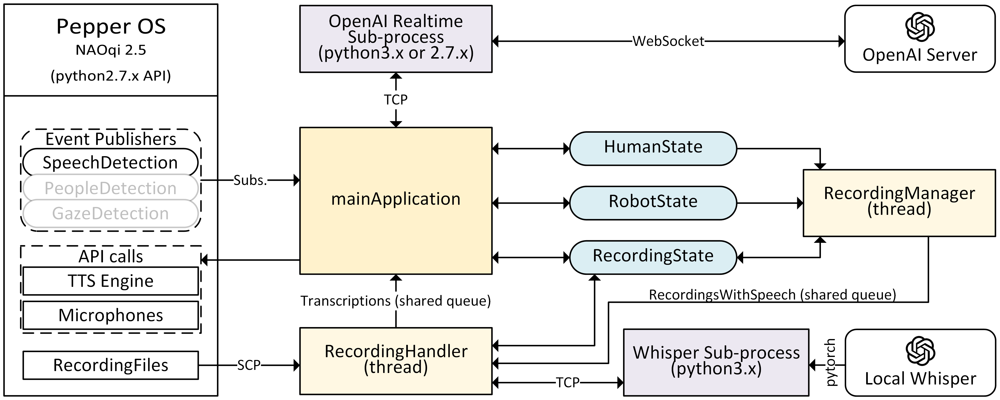

# LLM-powered dialogues with a Pepper robot
[`mainApplication.py`](./mainApplication.py)  uses Pepper's voice activity detection system to start/stop audio recordings, copy the recording files from the robot to the local system, transcribes the recordings using `openai-whisper` package using a local Whisper model, and uses OpenAI Realtime webclient to request and receive responses through a WebSocket. The LLM response is later uttered by the robot.

Overall system architecture looks like this:



The system is implemented for Pepper robots running NAOqi 2.5 operating system, and uses qi Python API and SDK.
qi SDK only supports Python 2, so the `mainApplication.py` should be run using Python 2.7.X.
Step-by-step test codes are available in [`./testCode/`](/testCode/), which may help using the system with a different robot and/or a different verbal interaction system.
These can be run using either Python2 or Python3. 

## Setup
It is recommended to setup two conda environments, one with Python 2.7.x to use NAOqi SDK, and one with Python 3.x to use `openai-whisper` package.
Anaconda environment files for these two environments are provided in [`pepper-env.yml`](/pepper-env.yml) and [`whisper-env.yml`](/whisper-env.yml) respectively.
To create these environments, run:
```bash
conda env create -f pepper-env.yml
conda env create -f whisper-env.yml
```
Additionally, `qi Python SDK` should also be installed on your system.

Once all the installations are complete
1. Edit the [`config.py`](/config.py#L23) file and make sure the Python3 environment path is set correctly
2. Enter your OpenAI access key in [`config.py`](/config.py#L27) to access the Realtime servers
3. Feel free to edit the LLM prompt in [`config.py`](/config.py#L29)
4. Activate your Python2 environment (`conda activate pepperDia-py2`)
5. And run
```bash
python mainApplication.py --ip your.pepper.robot.ip
``` 

The application should then:
1. Wait until the robot detects a human gaze on it
2. Request a conversation initiation utterance from the Realtime server using a specific text token (`<LOOKING>`)
3. Keep conversing with the person as long as the person is still visible
4. Break long silences by initiating conversation using a specific text token (`<LONG_SILENCE>`)
5. Go to step 1 if the person is no longer detected.

The sub-process outputs are exported in [`./logs/`](/logs/) directory.
Error message, OpenAI request costs, and similar relevant information can be tracked using these log files.

## Using with another voice activity detection system
The [`mainApplication.py`](./mainApplication.py) uses a [`PepperProxy`](./lib/pepperProxy.py) class to communicate with the robot.
Ideally, this class can be replaced with another to adapt the whole system to be used with a different voice activity detection system.
In this case,
1. The [callback functions](./mainApplication.py#L20) `callback_speechDetected`, `callback_gazeDetected`, `callback_humanDetected`, `callback_humanLeft` should either be replaced according to the new target voice activity system's functionalities or removed
2. The [`RecordingManager`](./lib/recordingManagers.py#L6) class should be provided with available methods during [initialization](./mainApplication.py#L159) to start and stop audio recordings using the target system
3. The [`RecordingHandler`](./lib/recordingManagers.py#L91) class should be provided with a method during [initialization](./mainApplication.py#L166) to fetch the recording from the target system, if necessary
4. Directory for the audio file source, [`SOURCE_AUDIO_FILE_PATH`](./config.py#L13) should be edited as appropriate
5. Fingers should be crossed.

Another good starting point for integrating another voice activity system is following the test code in [`./testCode/`](./testCode/) from step `a-..py` to step `d-..py`, and making sure that the intended functionalities work with each individual sub-block of the system.