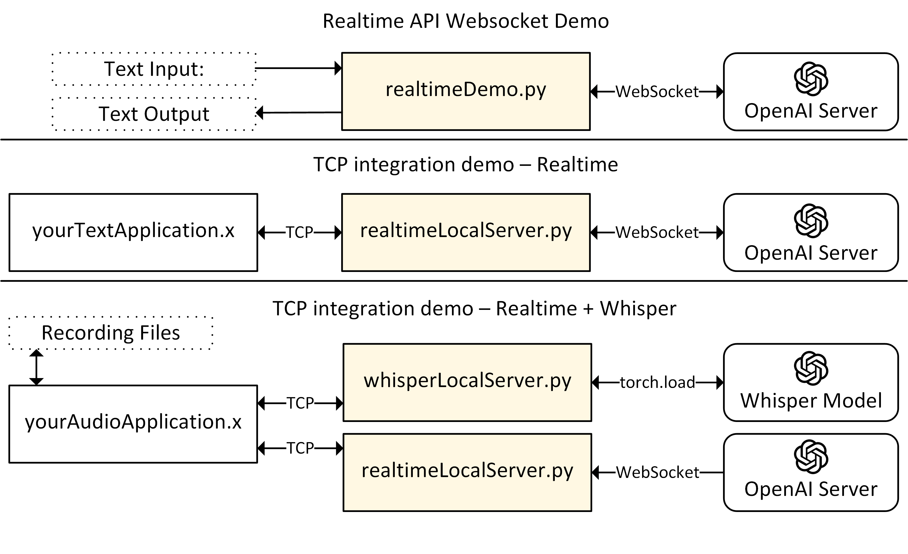

# Integration demonstrations for the provided modules
The scripts here are intended to serve as demo applications for the modules inside [`../lib/`](../lib/).
The main purpose of these demos is to examplify how these modules can be connected with applications that are not based on a Pepper robot.
These demos are especially relevant if you intend to use these modules in conjunction with non-python applications.

The summary of three demo scenarios are shown below.



## Setup
To run the code here, you can use the conda environment you've created for the Whisper python using [`whisper-env.yml`](../whisper-env.yml) if you already have.
By default settings, you can activate it by running:
```bash
conda activate pepperDia-py3
```
Make sure to enter your OpenAI credentials as described in the [main readme file](../README.md#L25).

## Realtime API WebSocket demo
To interact with the OpenAI Realtime servers through text, run
```bash
python realtimeDemo.py
```

This code only asks the server to generate text output, so it should be cheaper than trying it out on the [platform.openai.com](https://platform.openai.com).


## TCP integration demo - Realtime API Websocket 
In a terminal window, start the Realtime local server process:
```bash
python realtimeLocalServer.py
```
In another terminal window, run your application:
```bash
python yourTextApplication.py
```

`yourTextApplication` communicates with the `realtimeLocalServer` through the TCP port on your localhost, simulating a case where you may want to use multiple processes--which are not necessarily python processes--that will interact with the Realtime servers.

## TCP integration demo - Whisper transcription to Realtime API Websocket 
In a terminal window, start the Whisper transcription local server process:
```bash
python whisperLocalServer.py
```
In another terminal window, start the Realtime local server process:
```bash
python realtimeLocalServer.py
```
On a third terminal, run your audio to response application,
```bash
python yourAudioApplication.py
```

`yourAudioApplication` makes two localhost connections through two TCP ports.
It first communicates with the [`whisperLocalServer`](./whisperLocalServer.py) to transcribe an audio file from the [`RECORDINGS`](./yourAudioApplication.py#L7), and sends the transcription to [`realtimeLocalServer`](./realtimeLocalServer.py) to generate an LLM response.
